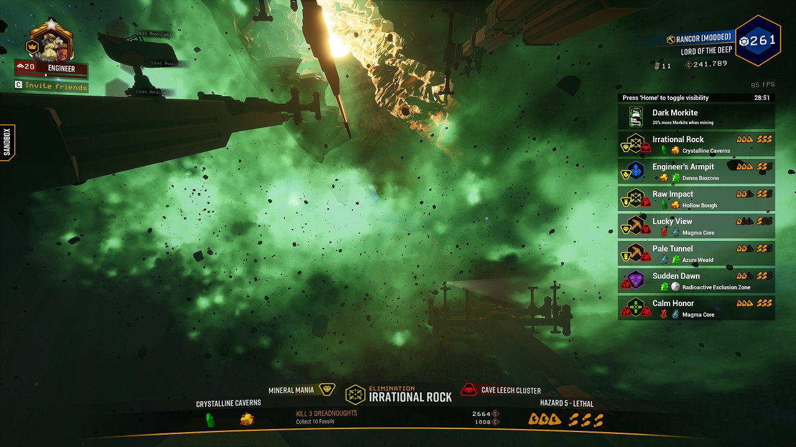

# DRG Rig HUD

This mod adds a HUD to the space rig to show more information at a glance.

It is released as [rancor's Rig HUD](https://drg.mod.io/rancors-rig-hud/) on [mod.io](https://mod.io/).

## Technical Overview

This section describes the components of this mod and how they fit together. The prefix "RH_" is short for "RigHUD" to clarify which blueprints are specifically for this mod.

* `InitSpacerig` - The mod's native entrypoint. Start here to see where we branch out to other blueprints.
* `RH_MissionDataCollector` - Collects mission data via other blueprints and creates, configures, and displays UI widgets.
* `RH_HUD` - The main widget for laying out the HUD additions. Additional widgets are created and added dynamically.
* `RH_StatusBar` - Widget row for displaying the status bar at the top, including the rotation countdown timer.
* `RH_BeerView` - Widget row for displaying the current beer special.
* `RH_MissionView` - Widget row for displaying mission information.
* `RH_Logger` - Widget for displaying debugging information. Unhooked for official builds.
* All other blueprints and C++ code are dummies for existing DRG assets and DRG code. They exist solely for mod assets to refer to at the build/compile/package phase, but are replaced by the actual assets/code at runtime. Refer to the guides below for more details.

## Build Instructions

1. Install `Unreal Engine 4.25.4`
1. Open `FSD.uproject`
1. Go to `File` --> `Generate Visual Studio Project`
   * Open the solution and build it.
1. Go to `File` --> `Package Project` --> `Windows (64-bit)` --> Target directory: `DRG-Rig-HUD\FSD\Package\`
   * The output should create `DRG-Rig-HUD\FSD\Package\WindowsNoEditor\`
   * The packing scripts assume this location in the steps below, so confirm that the directories were created as intended.
   * This path is saved in `FSD\Saved\Config\Windows\Game.ini`, but since it can only be a full path we cannot add it to source control.
1. Review this repo's build scripts that live in the [`Package`](https://github.com/Rampant-ai/DRG-Rig-HUD/tree/main/FSD/Package) directory.
   * Some "full paths" are unavoidable and may need to be customized for your file system. As you can see in the scripts, defaults are provided if you choose not to define your own environment variables. However, these defaults are _my_ install paths which are not typical. You can customize the scripts directly if you prefer, but those changes will show up in `git status` which can be irritating.
   * Add the Unreal Editor tools to your `%PATH%`: `C:\<your_install_path>\UE_4.25\Engine\Binaries\Win64\`. This allows you to run `UnrealPak.exe` from any script or shell without the full path.
   * Define `%DRG_MODS%` to point to your DRG Mods directory: `C:\<your_install_path>\Steam\steamapps\common\Deep Rock Galactic\FSD\Mods`
1. Run [`Package\build-pak.bat`](https://github.com/Rampant-ai/DRG-Rig-HUD/blob/main/FSD/Package/build-pak.bat) to build and install the pak for testing.
   * Some of these scripts are sensitive to the "current directory" so I *DO NOT* recommend making shortcuts to them! Just double-click to run.
   * The staging script [`Package\1-stage.bat`](https://github.com/Rampant-ai/DRG-Rig-HUD/blob/main/FSD/Package/1-stage.bat) may need to be updated if you add new blueprint directories!
   * Your pak should end up here: `%DRG_MODS%\RigHUD\RigHUD.pak`
1. Launch DRG and enable the mod in your Mods menu.
1. _(Optional)_ Run [`Package\clean.bat`](https://github.com/Rampant-ai/DRG-Rig-HUD/blob/main/FSD/Package/clean.bat) to remove all files generated from the above steps. This runs much faster than using the mouse, and can save lots of disk space.
1. _(Optional)_ Copy DRG's main pak file from `Steam\steamapps\common\Deep Rock Galactic\FSD\Content\Paks\FSD-WindowsNoEditor.pak` into the `Package\` directory, then drag the newly copied file onto [`unpack.bat`](https://github.com/Rampant-ai/DRG-Rig-HUD/blob/main/FSD/Package/unpack.bat) to unpack all of its assets. This can help verify how assets are organized if you need to override or dummy them for your mod.

## Learning Recommendations

* Advanced modding involves "dummying" the game's own C++ functions so that you can call them from your own blueprints. This guide contains some references to that to help you get started: https://github.com/DRG-Modding/Guides/tree/main/BP%20Guide
* This repository contains the header dumps for recent patch versions, to know what can be dummied: https://github.com/DRG-Modding/Header-Dumps/
* These examples show how reflecting works for functions, properties, and delegates: https://github.com/DRG-Modding/Reflected-Header-Classes
